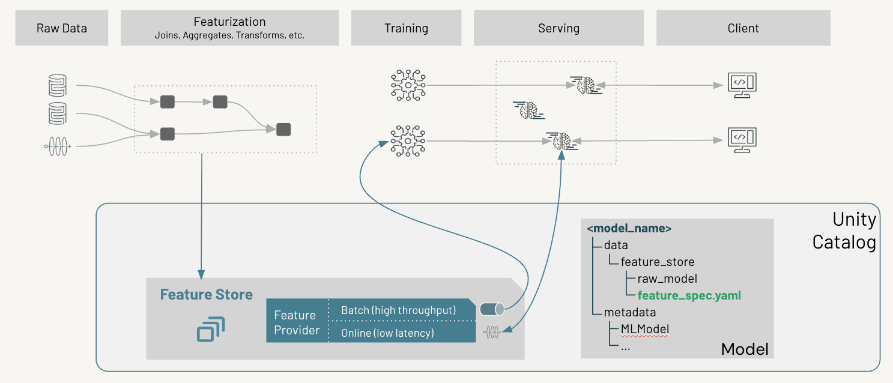
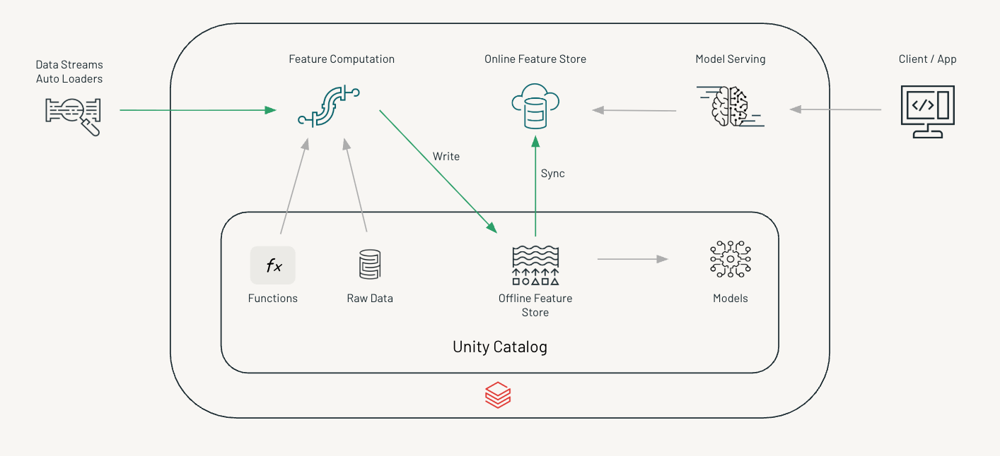
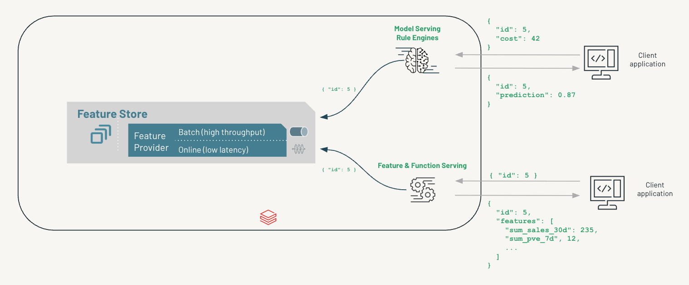
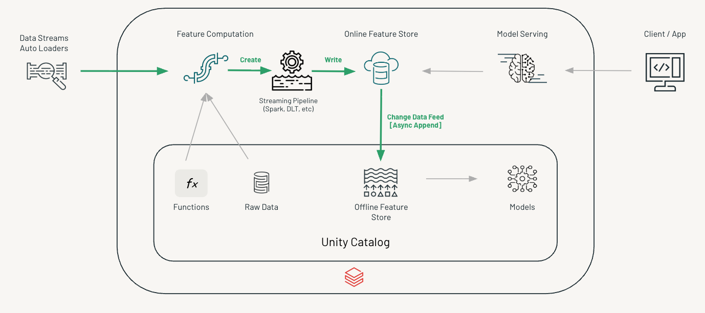
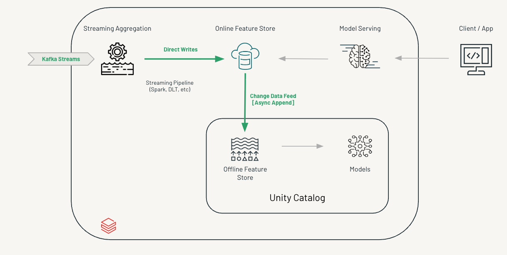

# Databricks Feature Store

## On Demand Feature Engineering

**On-demand** refers to features whose values are not known ahead of time, but are calculated at the time of inference. **Do Not Use Feature Store**

This is exactly the functionality of Tecton's [realtime feature](https://docs.tecton.ai/docs/tutorials/building-realtime-features). At the end of Q2 (July), Tecton's realtime feature will be integrated to managed on-demand feature below with enhancement in performance and flexility. You can test the existing managed on-demand feature to get familiar with the general functionality

* [Managed on-demand feature](https://docs.databricks.com/aws/en/machine-learning/feature-store/on-demand-features) (GA)
  * Leverage Unity Catalog UDFs as FeatureFunctions for feature engineering logic
  * Governed by Unity Catalog
  * Feature sharing can be performed using a [FeatureSpec](https://docs.databricks.com/aws/en/machine-learning/feature-store/concepts#featurespec)

    ```python
    from databricks.feature_engineering import FeatureEngineeringClient, FeatureLookup, FeatureFunction

    fe = FeatureEngineeringClient()

    fe.create_feature_spec(
        name="main.ml.my_shared_features",   # stored at this UC path
        features=[
            FeatureLookup(table_name="main.ml.customer_profile", lookup_key="user_id"),
            FeatureFunction(udf_name="main.ml.compute_score", output_name="score", ...),
        ]
    )
    ```
  * Requirements: 
    * Training workflow need to use Databricks Feature Engineering API and incoorperate FeatureFunctions so it is aligned with inference pipeline
  * [Example Code](https://github.com/qian-yu-db/databricks-feature-store-examples/on_demand_feature)
* Custom on-demand feature
  * Build a python wheel for feature logics with pyfunc object, deploy the python wheel to model serving endpoint. (i.e. raw data in as endpoint requests, features out as endpoint responses)
  * Governed by Unity Catalog
    * Python wheel of feature logic registered as a model object in unity catalog
    * Feature sharing can be accomplished by sharing model serving endpoint for different models as a way to retrieve features
  * No need to change training workflow
  * [Example Code](https://github.com/qian-yu-db/databricks-feature-store-examples/custom_feature_serving)


## Offline / Online Feature Store

This is the existing databricks managed solution solution currently in GA 



* offline feature store for training and batch inference, online feature store for inference. 
* Governed by Unity Catalog



* Offline store sync to online feature store.

* Documents with notebook examples:
  * [Training with Feature Tables](https://docs.databricks.com/aws/en/machine-learning/feature-store/train-models-with-feature-store)
  * [Online Feature Store](https://docs.databricks.com/aws/en/machine-learning/feature-store/online-feature-store)
  * [Online Feature Lookup](https://docs.databricks.com/aws/en/machine-learning/feature-store/automatic-feature-lookup)

    


## [Declarative Feature (BETA)](https://docs.databricks.com/aws/en/machine-learning/feature-store/declarative-apis)

The Declarative Feature Engineering APIs enable you to define and compute features from data sources. Features can be defined using a variety of sources (Delta table and request-time data) and computations (time-windowed aggregations, simple column selections, and more). This is a new API for the same technologies but it also introduced new capability under it.

* [Declarative API Reference](https://docs.databricks.com/aws/en/machine-learning/feature-store/declarative-api-reference)
* [Materialize Declarative Feature](https://docs.databricks.com/aws/en/machine-learning/feature-store/materialized-features) (Batch)
* [Declarative Feature Streaming](https://docs.databricks.com/aws/en/machine-learning/feature-store/streaming-declarative-features)

  * Write to online feature store and async feed to offline feature store


  * Streaming with autoloders

    

  * Streaming with Kafka 

    

