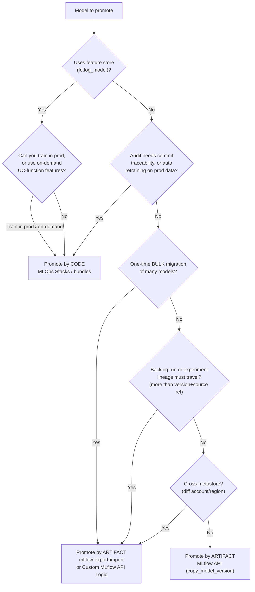

# Promoting and Migrating ML Models Across Workspaces

### A decision guide for moving models from dev to prod on Databricks

**Audience:** ML engineers and data scientists who have a trained, registered model and now need to get it into a production workspace — either as a one-time migration or as a repeatable promotion step. Assumes familiarity with MLflow, Models in Unity Catalog, and aliases; assumes nothing about which promotion approach to pick.
**Scope:** moving a *registered model* (and, where needed, its experiment lineage and features) between environments — separate catalogs, separate workspaces, or separate metastores. Training, serving, and monitoring are out of scope except where they force a promotion decision.

> **On release status.** Tags below — `[GA]`, `[Community OSS]`, `[Deprecated]` — reflect the verification date and will drift. Anything not `[GA]` is unsuitable for production without your own validation.

---

## Contents

- [1. The two fundamental patterns](#1-the-two-fundamental-patterns)
- [2. The decision: four dimensions](#2-the-decision-four-dimensions)
- [3. The tools at a glance](#3-the-tools-at-a-glance)
- [4. Tool — MLflow API (promote by artifact)](#4-tool--mlflow-api-promote-by-artifact)
- [5. Tool — mlflow-export-import (promote by artifact, bulk / cross-metastore)](#5-tool--mlflow-export-import-promote-by-artifact-bulk--cross-metastore)
- [6. Tool — MLOps Stacks / bundles (promote by code)](#6-tool--mlops-stacks--bundles-promote-by-code)
- [7. Cross-cutting concerns](#7-cross-cutting-concerns)
- [8. Pitfalls](#8-pitfalls)
- [9. Reference](#9-reference)

---

## 1. The two fundamental patterns

**Promote by code.** The *training pipeline* moves through environments. Each environment runs the same reviewed code and trains its own model on its own data. What crosses the boundary is a Git commit, deployed as a job. The prod model is a fresh artifact produced *in* prod.

```
feature branch → PR + CI → merge → deploy to staging → staging trains
  → release → deploy to prod → prod trains on prod data → alias flipped
```

**Promote by artifact.** The *trained model binary* moves through environments. You train once (usually in dev), validate the artifact, then copy that exact artifact into the target registry and point serving at it. No retraining crosses the boundary.

```
train in dev → validate artifact in staging → copy artifact to prod → alias flipped
```

The trade-off in one line: **promote by code gives you reproducibility, prod-data training, and clean lineage; promote by artifact gives you an immutable, train-once binary and a faster path when training is expensive.** Databricks recommends promote-by-code as the default; promote-by-artifact is for specific cases (expensive/rare training, artifact-immutability regulation, single-workspace setups). Section 2 turns "specific cases" into a checklist.

> If you also need the deeper background on *why* deploy-code is the default — CI/CD shape, lineage edges, rollback semantics — see §5 of `ml-on-databricks-guide.md`. This guide is self-contained but does not re-derive that reasoning.

---

## 2. The decision: four dimensions

Four questions decide the pattern and the tool. Answer all four; the strongest constraint wins.

### 2.1 The dimensions

| # | Dimension | Left option | Right option |
|---|---|---|---|
| **D1** | **What moves** | Promote by **code** | Promote by **artifact** |
| **D2** | **What lineage you need** | Run/experiment lineage must **travel** (see tiers below) | **Model artifact only** is enough |
| **D3** | **Cadence & volume** | **Bulk** migration of existing models (one-time) | **On-demand** promotion (ongoing ops process) |
| **D4** | **Feature store** | **Uses** Feature Engineering in UC (`fe.log_model`) | **No** feature store — plain model inputs |

How each dimension pushes the decision:

- **D1 — what moves.** This is the pattern itself. If audit rules require every prod asset to trace to a reviewed commit, or retraining must be automated, you are in *promote by code*. If the exact tested binary must be the deployed binary, you are in *promote by artifact*.
- **D2 — lineage.** The deciding question is *what must land in the target beyond the bare version?*
  There are three tiers:
  - **Artifact only** — version + a source-version reference. `copy_model_version()` is enough; the backing run is *referenced*, not copied.
  - **Just the run that created the version** — its params, metrics, and artifacts. This is more than the native copy carries, so it needs **`mlflow-export-import`** (`export-model` copies each version's backing run) — **not** the whole experiment. *(MLflow 3 nuance: params/metrics logged on the `LoggedModel` entity itself, rather than only on the run, may travel with `copy_model_version()` — verify per §4.2 before relying on it.)*
  - **Full experiment** — all sibling runs. `mlflow-export-import` `export-experiment`/`export-all`, or **deploy-code** (lineage is re-created natively in the target catalog).

  The last two tiers both sit on the "needs lineage" side and point to `mlflow-export-import`; they
  differ only in the export command. Users can also develop their own custom logic using [MLflow API](https://mlflow.org/docs/latest/api_reference/python_api/index.html) which is also what `mlflow-export-import` core uses. In particular: `mlflow.tracking`, `mlflow.artifacts`, and `mlflow.enities`.

- **D3 — cadence & volume.** A one-time move of *many* existing models (workspace consolidation, a metastore/region migration, an acquisition) is a **batch** job — `mlflow-export-import` is built for it. A repeatable, per-model promotion embedded in an ops process is a **single-model operation** — the [MLflow API](https://mlflow.org/docs/latest/api_reference/python_api/index.html) (an alias flip or one `copy_model_version()`) or a deploy-code CI/CD step.
- **D4 — feature store.** This one can override D1. When you log a model with `fe.log_model()`, the feature table names are **embedded in the artifact** as lookup metadata. Copy that artifact from dev to prod and it still resolves `<dev_catalog>.features...` in production — silently serving stale dev features. **A model that uses the feature store should be promoted by code** unless you take an explicit escape hatch (§7.1). No feature store → artifact promotion is safe.

### 2.2 Decision matrix

Read your situation across the top; the cell gives the recommended pattern and tool.

| Situation | Pattern | Tool | Why |
|---|---|---|---|
| Uses feature store (`fe.log_model`) | **Code** | MLOps Stacks / bundles | Embedded feature refs must resolve to prod tables (§7.1) |
| Automated scheduled retraining on prod data | **Code** | MLOps Stacks / bundles | Prod trains its own model; retrain re-runs reviewed code |
| Audit requires commit-traceable prod assets | **Code** | MLOps Stacks / bundles | Everything in prod came from a reviewed PR |
| Train-once / very expensive training, **same metastore** | **Artifact** | MLflow API (`copy_model_version`) | Move the binary; no retrain; native UC copy |
| Train-once / expensive, **cross-metastore** (diff account/region) | **Artifact** | `mlflow-export-import` or MLflow API | `copy_model_version` does not cross metastores (§4.3) |
| One-time bulk migration of many existing models | **Artifact** | `mlflow-export-import` | Batch export/import; optional run + experiment lineage |
| Backing run **or** full experiment must travel with the artifact | **Artifact** | `mlflow-export-import` | `export-model` copies each version's run; `export-experiment`/`export-all` copies siblings too |
| On-demand promotion, single model, same metastore, no feature store | **Artifact** | MLflow API (alias flip or `copy_model_version`) | Lightest possible operation |
| Everything in one workspace, separated only by catalog | **Artifact** | MLflow API (`copy_model_version`) | No workspace boundary to cross |

When two rows apply, the **feature-store and audit rows win** — they are hard constraints, not preferences.

### 2.3 Decision flow



---

## 3. The tools at a glance

| Tool | Pattern | Boundary it crosses | Lineage that travels | Best for | Support |
|---|---|---|---|---|---|
| **MLflow API** — `copy_model_version()`, aliases | Artifact | Cross-catalog / cross-workspace **within one metastore** | Model version + source-version reference | On-demand single-model promotion | `[GA]`, Databricks-supported |
| **mlflow-export-import** | Artifact (bulk) | Cross-workspace **and cross-metastore** (account/region) | Optional: runs, experiments, model — full export | Bulk one-time migration; cross-metastore; lineage must travel | `[Community OSS]` — not Databricks-supported |
| **Custom MLflow-API logic** — `mlflow.tracking` / `mlflow.artifacts` / `mlflow.entities` | Artifact | Any — you control export → storage → import, incl. cross-metastore | **Whatever you implement** (version, backing run, artifacts) | A tested subset of export-import you own; custom transforms mid-migration | **Your code** — no external support status (§5.4) |
| **MLOps Stacks / bundles** | Code | Any target environment (each trains its own model) | Re-created **natively** in the target catalog | Repeatable promotion, feature-store models, audited pipelines | `[GA]`, Databricks-supported |

The first three promote by artifact; the last promotes by code. The three artifact approaches form a spectrum of **control vs. effort**: `copy_model_version()` is the least code but same-metastore only; `mlflow-export-import` is the most features but an unsupported dependency; **custom MLflow-API logic** sits between — you write a tested subset yourself, gaining cross-metastore reach and custom transforms at the cost of building and maintaining it. All three differ on **reach** and **how much lineage travels**, not on the fundamental pattern.

---

## 4. Tool — MLflow API (promote by artifact)

The native, GA path for moving a *single* model artifact within one Unity Catalog metastore. Two sub-cases: the model already lives in the target registry (just flip the alias), or it must be copied into the target registry first.

### 4.1 Aliases: the promotion primitive

In UC there are no stages — promotion is an **alias reassignment**. Serving endpoints, batch jobs,
and dashboards all reference the alias (`@Champion`), never a version number, so promotion and
rollback are the same one-line operation.

```python
from mlflow import MlflowClient
client = MlflowClient(registry_uri="databricks-uc")

# promote: point Champion at the validated version
client.set_registered_model_alias("<catalog>.<schema>.<model>", "Champion", version=7)

# rollback: point it back — effective immediately, no redeploy
client.set_registered_model_alias("<catalog>.<schema>.<model>", "Champion", version=6)
```

Record *how* a version earned promotion with a tag, so the audit trail lives on the version itself:

```python
client.set_model_version_tag(
    name="<catalog>.<schema>.<model>", version="7",
    key="validation_status", value="approved",
)
```

### 4.2 Copying a version into another registry (same metastore)

`copy_model_version()` (MLflow ≥ 2.8.0) copies a version from one registered model to another,
including across catalogs and across workspaces that share a metastore:

```python
copied = client.copy_model_version(
    src_model_uri="models:/<dev_catalog>.<schema>.<model>/12",
    dst_name="<prod_catalog>.<schema>.<model>",
)
client.set_registered_model_alias("<prod_catalog>.<schema>.<model>", "Champion", copied.version)
```

Cross-workspace copies require the catalog binding and grants set up first (do this once, as a
platform/admin step):

```sql
-- let the prod workspace read the dev catalog, read-only
ALTER CATALOG <dev_catalog> SET BINDING READ_ONLY TO workspace <prod_workspace_id>;

-- the promoting service principal needs to read the source and create in the target
GRANT USE CATALOG  ON CATALOG <dev_catalog>            TO `<deploy_sp>`;
GRANT USE SCHEMA   ON SCHEMA  <dev_catalog>.<schema>   TO `<deploy_sp>`;
GRANT EXECUTE      ON MODEL   <dev_catalog>.<schema>.<model> TO `<deploy_sp>`;
GRANT CREATE MODEL ON SCHEMA  <prod_catalog>.<schema>  TO `<deploy_sp>`;
```

> **Verify copy depth for your setup.** The MLflow docs describe `copy_model_version()` as copying
> "a model version … as a new model version" but are not explicit about whether the destination's
> run is *copied* or merely *referenced*. If the source workspace or run could later be deleted,
> confirm the destination's lineage survives before depending on it. If full lineage must travel,
> use `mlflow-export-import` (§5) instead.

### 4.3 What this tool cannot do

- **Cross-metastore.** `copy_model_version()` operates within one metastore. Separate Databricks
  accounts or regions have separate metastores and there is **no native copy path** — use
  `mlflow-export-import` or re-train in the target.
- **Bulk.** It copies one version at a time. You can loop it for a handful of models, but a
  hundreds-of-models migration wants a purpose-built batch tool.
- **Full experiment lineage.** It moves the model version, not the run/experiment history.

### 4.4 On-demand promotion, scripted

The repeatable ops-process shape (D3 = on-demand): a small script or job step that validates, then
copies-and-aliases. Run it as a service principal (§7.3).

```python
# 1. validate the candidate (metrics gate, smoke prediction, etc.)
# 2. copy into prod registry
copied = client.copy_model_version(
    src_model_uri="models:/<dev_catalog>.<schema>.<model>/12",
    dst_name="<prod_catalog>.<schema>.<model>",
)
# 3. flip the alias; serving follows automatically
client.set_registered_model_alias("<prod_catalog>.<schema>.<model>", "Champion", copied.version)
```

---

## 5. Tool — mlflow-export-import (promote by artifact, bulk / cross-metastore)

An open-source, community-maintained tool (`mlflow/mlflow-export-import`) that exports MLflow objects — runs, experiments, and registered models — from one tracking server and imports them into another. It is the field-standard answer for the two cases the native API can't reach: **bulk migration** and **cross-metastore** moves. It supports the UC Model Registry.

> ⚠️ **Support status — read before adopting.** This is **community OSS, not covered by Databricks > support**. Treat it as a migration utility you run and verify, not a supported production dependency.

### 5.1 When it is the right tool

- **Bulk one-time migration** — consolidating workspaces, moving a metastore, region migration, post-acquisition merges. Export many models/experiments in one batch, import into the target.
- **Cross-metastore / cross-account / cross-region** — the boundary `copy_model_version()` cannot cross.
- **Lineage must travel (D2)** — unlike the native copy, it can export the **runs and experiments** behind a model, so params, metrics, and artifacts land in the target rather than a bare version.

### 5.2 Shape of use

Install and point it at source and target profiles; export to an intermediate directory (or cloud
storage), then import:

```bash
pip install mlflow-export-import

# export a registered model (optionally its versions' runs & experiments) from the source
export-model \
  --model <dev_catalog>.<schema>.<model> \
  --output-dir /tmp/export/<model>

# import into the target metastore/workspace (uses the target's MLflow/Databricks profile)
import-model \
  --input-dir /tmp/export/<model> \
  --model <prod_catalog>.<schema>.<model> \
  --experiment-name /Users/<sp>/<model>_imported
```

Bulk variants (`export-all` / `export-models` and their import counterparts) move many objects at once — that is the reason to reach for this tool over a `copy_model_version()` loop.

### 5.3 Caveats specific to migration

- Re-check the tool supports your **UC** registry operations on your MLflow version — behavior has shifted across MLflow 2 → 3.
- **Feature-store models still carry embedded feature references** (§7.1). Exporting and importing the artifact does *not* rewrite them — the imported model still points at the source feature tables. This tool moves artifacts; it does not fix the promote-by-artifact feature-store problem.
- Imported runs land under a **new experiment** in the target; plan the target experiment naming so lineage stays legible.
- Verify **who owns** the imported objects (run it as the target service principal) and that grants exist in the target schema.

### 5.4 Roll your own: a subset with the MLflow client API

`mlflow-export-import` is itself just orchestration over MLflow's public client APIs. If you can't take an unsupported community dependency (security review, supply-chain policy), or you need only a narrow slice of what it does — "copy this model's `@Champion` version and its backing run into another metastore" — you can implement that slice yourself with `mlflow.tracking`, `mlflow.artifacts`, and `mlflow.entities`. Think of it as a **tested subset of export-import that you own.**

**Reach for this when:**

- You need export-import's reach (cross-metastore, bulk) but **cannot adopt the community package**.
- You need only a **narrow, well-defined subset**, and prefer code you own, test, and version.
- You want to **inject custom transforms mid-migration** — rewrite feature-table references (§7.1),
  remap experiment paths, filter which versions move, redact tags. This is the one thing the
  pre-built tool cannot do for you.

**The building blocks:**

| API | Use |
|---|---|
| `mlflow.tracking.MlflowClient` | Read/create registered models, versions, aliases, tags; `get_run`, `search_model_versions`, `create_model_version` |
| `mlflow.artifacts` | `download_artifacts` / `log_artifacts` — move the model files and run artifacts between tracking servers |
| `mlflow.entities` | The typed objects (`Run`, `ModelVersion`, `RunData`) you read from source and reconstruct in target |

**Minimal sketch** — copy the `@Champion` version (and, optionally, its backing run) across metastores using two profiles:

```python
import mlflow
from mlflow import MlflowClient

src = MlflowClient(registry_uri="databricks-uc://<src_profile>")
dst = MlflowClient(registry_uri="databricks-uc://<dst_profile>")

# 1. locate the source version behind the alias
mv = src.get_model_version_by_alias("<dev_catalog>.<schema>.<model>", "Champion")

# 2. stage its artifacts (to shared cloud storage, or local then re-upload)
local = mlflow.artifacts.download_artifacts(artifact_uri=mv.source)

# 3. (optional) recreate the backing run in the target so lineage travels — the D2 "just the run" tier
run = src.get_run(mv.run_id)
with mlflow.start_run() as new_run:                 # against the dst tracking server
    mlflow.log_params(run.data.params)
    mlflow.log_metrics(run.data.metrics)
    mlflow.log_artifacts(local)

# 4. register the staged artifact as a new version in the target, then alias it
new_mv = dst.create_model_version(
    name="<prod_catalog>.<schema>.<model>",
    source="<staged_artifact_uri>",
    run_id=new_run.info.run_id,                      # or None if you skipped step 3
)
dst.set_registered_model_alias("<prod_catalog>.<schema>.<model>", "Champion", new_mv.version)
```

**Trade-off.** You now own the edge cases the pre-built tool already handles — model signatures, tags, nested artifacts, dependency lists, retries, large-artifact staging. Port only the subset you can test, keep it in version control, and diff source vs. target after each run. It has *no* support status because it is your code — which is exactly the point for teams that can't take the community dependency. Like export-import, it does **not** fix embedded feature references (§7.1) unless you deliberately rewrite them in step 2–4 — which is a common reason to write custom logic in the first place.

---

## 6. Tool — MLOps Stacks / bundles (promote by code)

The GA, Databricks-supported way to promote by code. "MLOps Stacks" is a bundle template that scaffolds a full deploy-code project; "bundles" (Declarative Automation Bundles, formerly Databricks Asset Bundles) are the IaC layer underneath it. This is the recommended default, and the **required** approach for feature-store models and audited pipelines.

### 6.1 Scaffold it

```bash
databricks bundle init mlops-stacks
```

This generates training, validation, and deployment pipelines, tests, a `databricks.yml` with dev/staging/prod targets, and CI/CD workflows (GitHub Actions or Azure DevOps). Even if you don't adopt it wholesale, generating one and reading it is the fastest way to see how the pieces fit.

### 6.2 How promotion works here

Nothing is *copied* between environments — the **code** is deployed to each target and each target **trains its own model**. One variable swaps the catalog, so nothing in your Python is environment-aware:

```yaml
targets:
  dev:
    default: true
    variables: {catalog: <dev_catalog>}
  prod:
    mode: production
    workspace: {host: https://<prod_workspace>.cloud.databricks.com}
    variables: {catalog: <prod_catalog>}
```

```bash
databricks bundle validate
databricks bundle deploy -t prod     # push the reviewed code to prod
databricks bundle run train_job -t prod   # prod trains on prod data; CI flips the alias
```

The promotion "mechanism" is `databricks bundle deploy` + a training run + an alias flip — all from a reviewed commit, all attributable to a service principal.

### 6.3 Why it's the answer for feature-store models

Because prod trains its own model against **prod** feature tables, the lookup metadata embedded in the artifact points at `<prod_catalog>` from the start. There is no dev reference to leak (§7.1).  This is the clean solution to the embedded-feature-reference problem — the escape hatches in §7.1 exist only for teams that can't adopt deploy-code.

### 6.4 Cost and setup trade-offs

- You **pay to train in each environment**. Limit staging to a data subset; use serverless to avoid
  idle spend.
- The CI/CD setup is more involved than an alias flip — that's what MLOps Stacks scaffolds for you.
- Data scientists need **read access to prod experiments** to see how the prod-trained model
  actually did.

---

## 7. Cross-cutting concerns

### 7.1 Feature store forces the pattern

When a model is logged with `fe.log_model()`, feature table names are baked into the artifact as lookup metadata. Promote that artifact by copy and serving resolves the **wrong** catalog:

```
Trained in dev   → embedded lookup: <dev_catalog>.features.customer_features
copy / export-import → prod
Served in prod   → still resolves <dev_catalog>.features.customer_features   ← wrong, silent
```

The endpoint reads the dev online store — staler, unmonitored, possibly a sample. Nothing errors; predictions are just quietly worse. Three ways out, best first:

1. **Promote by code** (§6). Each environment trains against its own feature tables; the embedded reference is always correct. The default answer.
2. **Train in dev against prod feature tables.** Grant dev read-only access to prod features so the artifact embeds `<prod_catalog>` references and resolves correctly after promotion. Lets you keep promote-by-artifact.
3. **On-demand features via UC functions.** Resolved at inference time rather than baked in, keeping the model catalog-agnostic.

This is why D4 can override D1 in the matrix.

### 7.2 Lineage: what survives each route

| Lineage edge | Deploy code | MLflow API copy | mlflow-export-import |
|---|---|---|---|
| Training-data version → model | Prod data → prod model | Points at **dev** data | Exportable (source data version) |
| Feature table → model | Prod feature table | **Dev** table — a gap (§7.1) | **Dev** table — a gap (§7.1) |
| Run params / metrics | Native in prod | **Not copied** (version + source ref only) | **Exportable** with the model |
| Model → serving endpoint | Direct, in prod catalog | Via copied version's source ref | Via imported version |
| Who promoted | Service principal (CI run) | SP if automated; human if manual | SP if automated; human if manual |

Reading: **deploy-code keeps every edge inside the prod catalog**; the artifact routes leave the training-data and feature edges pointing at the source unless you deliberately trained against prod tables. `copy_model_version()` additionally drops run params/metrics; `mlflow-export-import` can carry them if you export runs/experiments. **Custom MLflow-API logic (§5.4) carries exactly what you code** — as complete as export-import if you recreate the run, or as thin as the native copy if you don't — and is the only route that can *rewrite* the feature-table edge during migration.

### 7.3 Service principals and grants

Automation that promotes to prod must run as a **service principal with OAuth M2M**, never a human PAT — a PAT carries a person's full permissions, is unattributable in audit logs, and breaks when they leave. Name SPs after their function (`mlops-prod-deploy-sp`). The grants a promoting SP needs:

```sql
-- source (read the model to copy/export)
GRANT USE CATALOG ON CATALOG <src_catalog> TO `<deploy_sp>`;
GRANT USE SCHEMA  ON SCHEMA  <src_catalog>.<schema> TO `<deploy_sp>`;
GRANT EXECUTE     ON MODEL   <src_catalog>.<schema>.<model> TO `<deploy_sp>`;
-- target (create the model version and set aliases)
GRANT USE CATALOG  ON CATALOG <prod_catalog> TO `<deploy_sp>`;
GRANT USE SCHEMA   ON SCHEMA  <prod_catalog>.<schema> TO `<deploy_sp>`;
GRANT CREATE MODEL ON SCHEMA  <prod_catalog>.<schema> TO `<deploy_sp>`;
```

`USE CATALOG` + `USE SCHEMA` are always prerequisites — granting `EXECUTE`/`CREATE MODEL` alone silently fails.

---

## 8. Pitfalls

1. **Promoting a feature-store model by artifact.** Embedded dev feature references serve stale dev features silently. Promote by code, or take an escape hatch (§7.1).
2. **Assuming `copy_model_version()` crosses metastores.** It does not — different account/region means `mlflow-export-import` or re-train (§4.3).
3. **Expecting run params/metrics to travel with `copy_model_version()`.** Only the version and a source reference travel. Use export-import if lineage must move (§7.2).
4. **Treating `mlflow-export-import` as supported.** It's community OSS, last updated ~2024-05.  Validate on your MLflow/UC version in a non-prod migration first (§5).
5. **Granting object privileges without `USE CATALOG` / `USE SCHEMA`.** Copy/export fails with `PERMISSION_DENIED` (§7.3).
6. **Promoting as a human PAT.** Unattributable and breaks on staff change — use a service principal (§7.3).
7. **Editing the serving endpoint on every promotion.** Serve the alias and flip it instead; promotion and rollback become one operation (§4.1).
8. **Bulk-migrating with a `copy_model_version()` loop.** Fine for a handful; use export-import's batch commands for real volume (§4.3, §5.1).
9. **Losing track of imported experiment ownership/naming.** Imported runs land under a new experiment owned by the importer — plan target naming and run as the target SP (§5.3).
10. **Rolling your own migration without covering artifact edge cases.** A hand-written MLflow-API copier that skips signatures, tags, nested artifacts, or large-artifact staging drops them silently — port only the subset you can test and diff source vs. target after each run (§5.4).

---

## 9. Reference

### 9.1 Tool support status

| Tool | Status | Notes |
|---|---|---|
| Models in Unity Catalog + aliases | `[GA]` | Stages are `[Deprecated]` in UC |
| `copy_model_version()` | `[GA]`, MLflow ≥ 2.8.0 | Within one metastore; copy depth unverified (§4.2) |
| MLOps Stacks / Declarative Automation Bundles | `[GA]` | `databricks/mlops-stacks`, actively maintained |
| `mlflow-export-import` | `[Community OSS]` | Not Databricks-supported; README last updated 2024-05-10 |
| Custom MLflow-API logic | Your code | `mlflow.tracking` / `mlflow.artifacts` / `mlflow.entities`; support = whatever you maintain (§5.4) |

### 9.2 Quick chooser

- **Feature store, or audit/auto-retrain?** → Promote by **code** (MLOps Stacks / bundles).
- **Single model, same metastore, no feature store?** → **MLflow API** (`copy_model_version` + alias).
- **Bulk, cross-metastore, or lineage must travel?** → **mlflow-export-import** (validate first).
- **Need that reach but not the dependency, or only a narrow slice / custom transforms?** → **custom MLflow-API logic** (§5.4).

### 9.3 Links

- [Manage model lifecycle in UC](https://docs.databricks.com/aws/en/machine-learning/manage-model-lifecycle/)
- [MLflow Python API — `copy_model_version`](https://mlflow.org/docs/latest/python_api/mlflow.client.html)
- [MLflow Python API — client, artifacts, entities](https://mlflow.org/docs/latest/api_reference/python_api/index.html) — for custom promotion logic (§5.4)
- [MLOps Stacks](https://github.com/databricks/mlops-stacks)
- [Declarative Automation Bundles](https://docs.databricks.com/aws/en/dev-tools/bundles/)
- [mlflow-export-import](https://github.com/mlflow/mlflow-export-import) — community OSS
- [Feature engineering in Unity Catalog](https://docs.databricks.com/aws/en/machine-learning/feature-store/)
- Companion guide: `ml-on-databricks-guide.md` (full ML lifecycle; §5 covers promotion background)
