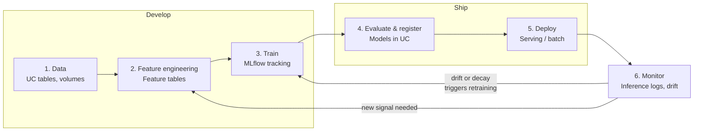

# Machine Learning on Databricks

### A guide to development setup, the ML lifecycle, and platform capabilities

**Audience:** experienced data scientists and ML engineers who are new to Databricks. Assumes
fluency in Python, ML practice, and Git; assumes nothing about Databricks.
**Scope:** classic / predictive ML (tabular, forecasting, classification, regression). GenAI and
agent workloads are a different stack — see [Out of scope](#out-of-scope).
**Last verified:** 2026-08-04 against `docs.databricks.com`.

> **On release status.** Every capability below carries a tag — `[GA]`, `[Public Preview]`,
> `[Beta]`, or `[Deprecated]`. Databricks ships fast and renames things; these tags were verified
> on the date above and will drift. Re-check the linked doc before you commit to a design, and
> treat anything not marked `[GA]` as unsuitable for production.

---

## Contents

- [1. Setting up your development environment](#1-setting-up-your-development-environment)
- [2. Platform foundations](#2-platform-foundations)
- [3. The ML lifecycle on Databricks](#3-the-ml-lifecycle-on-databricks)
- [4. Capability reference](#4-capability-reference)
- [5. From notebook to production](#5-from-notebook-to-production)
- [6. Reference](#6-reference)


---

## 1. Setting up your development environment

Setup comes first so you can follow the rest of the guide with a working environment. Two things
here reference concepts covered later — Unity Catalog naming
([§2.1](#21-unity-catalog-the-governance-layer)) and bundles
([§5.2](#52-declarative-automation-bundles)). You can follow the steps without them and read the
detail when you need it.

There are two legitimate ways to work, and the right answer depends on what you are doing rather
than on taste.

### 1.1 Path A — working in the workspace

Notebooks in the Databricks UI, backed by Git folders for version control.

**Good for:** exploration, first contact with unfamiliar data, sharing a result quickly,
collaborative debugging, anything needing the full ML Runtime with zero local setup.

**Setup:** log in, create a Git folder pointing at your repo, attach compute, start writing.

Notebooks are genuinely good at exploration. The limits show up when work needs to be reviewed,
tested, or reused: you cannot easily unit test a notebook, cell-execution order is invisible in a
diff, and `%pip` lines make the environment non-reproducible.

### 1.2 Path B — local IDE (VSCode, Pycharm, Cursor, etc)

This offers common developer experience with popular IDEs

**Step 1 — install the Databricks CLI.**

```bash
brew install databricks/tap/databricks     # macOS
databricks --version
```

The CLI is on the 1.x line (v1.10.0 released 2026-07-29). Bundles require ≥ 0.218.0, so any recent
version is fine.

**Step 2 — authenticate with OAuth.**

```bash
databricks auth login --host https://<workspace>.cloud.databricks.com --profile DEFAULT
databricks auth profiles          # verify; shows validity per profile
```

Use **OAuth**, not a personal access token. A human PAT carries your full permissions, is not
attributable to a pipeline in audit logs, and breaks when you change teams. PATs have a place in
automation, and even there a service principal with OAuth M2M is better
([§5.4](#54-cicd-and-service-principals)).

If a command later fails with an auth error, your token has expired — re-run `databricks auth login`.

**Step 3 — create the project.** Use `uv` for environment management:

```bash
uv init <project_name> && cd <project_name>
uv add databricks-connect databricks-sdk mlflow scikit-learn pandas
uv sync
```

A minimal `pyproject.toml` for an ML project — note the `[project.scripts]` entry point, which is
what a bundle job will invoke:

```toml
[project]
name = "<package_name>"
version = "0.1.0"
requires-python = ">=3.10"
dependencies = [
    "databricks-connect==16.1",     # match your DBR; see pairing rule below
    "databricks-sdk>=0.40.0",
    "mlflow>=3.3",
    "scikit-learn>=1.5",
    "pandas>=2.0",
]

[project.scripts]
train = "<package_name>.train:main"

[build-system]
requires = ["hatchling"]
build-backend = "hatchling.build"
```

**Step 4 — install the VS Code extension.** The Databricks extension for VS Code provides
workspace browsing, "Run on Databricks", bundle integration, and Databricks Connect wiring. Sign
in to your profile and attach compute from the extension panel.

> Other IDEs: research for this guide found **no current official Databricks plugin for
> PyCharm/JetBrains or Cursor**. Databricks Connect itself is a plain Python library, so any IDE
> can run and debug code that uses it — you just do not get the extension features.

**Step 5 — configure Databricks Connect.**

The pairing rule: *the DBR version of your compute must be greater than or equal to your
`databricks-connect` package version.* A 16.1 package against a DBR 16.4 cluster is fine; the
reverse is not.

For serverless, either set it in `.databrickscfg`:

```ini
[DEFAULT]
host = https://<workspace>.cloud.databricks.com
serverless_compute_id = auto
```

or select it in code:

```python
from databricks.connect import DatabricksSession
spark = DatabricksSession.builder.serverless().getOrCreate()
```

**Step 6 — write code that runs in both places.** The one pattern worth copying. Detect the
environment and build the session accordingly, so the same module works locally and as a job:

```python
import os
from pyspark.sql import SparkSession

try:
    from databricks.connect import DatabricksSession
except ImportError:
    DatabricksSession = None


def get_spark():
    if "DATABRICKS_RUNTIME_VERSION" in os.environ:   # running on a cluster
        return SparkSession.builder.getOrCreate()
    if DatabricksSession is None:
        raise RuntimeError("databricks-connect is not installed in this environment")
    return DatabricksSession.builder.getOrCreate()
```

Apply the same idea to MLflow, so local runs log to the workspace while cluster runs use the
ambient configuration:

```python
if "DATABRICKS_RUNTIME_VERSION" not in os.environ:
    mlflow.set_tracking_uri("databricks")
    mlflow.set_registry_uri("databricks-uc")
mlflow.set_experiment("/Users/<you>/<experiment_name>")
```

**Step 7 — verify.**

```bash
uv run python -c "from <package_name>.data_utils import get_spark; print(get_spark())"
```

### 1.3 The two execution models

The highest-value concept in this chapter. There are two ways to run code against Databricks from
an IDE, and they fail differently — knowing which one you are in shortens debugging enormously.

**Databricks Connect** — Python runs locally, Spark runs remotely:

```
Your laptop                          Databricks
├── Python process (your code)  ───▶  Spark cluster
├── sklearn, mlflow client            (DataFrame ops only)
└── full VS Code debugger
```

Spark operations are sent to the cluster; everything else — model fitting, plotting, control flow —
executes locally. `df.toPandas()` pulls results to your machine, and from there `model.fit()` uses
your laptop's CPU.

**Run on Databricks** — everything runs on the cluster:

```
Your laptop                          Databricks
└── source file  ──uploads──▶         Cluster executes all of it
                                      (needs every dependency installed)
```

| | Databricks Connect | Run on Databricks |
|---|---|---|
| Python executes | Locally | On the cluster |
| Dependencies needed | Locally (`uv sync`) | On the cluster (`%pip` or ML Runtime) |
| Debugging | **Full breakpoints and stepping** | Print statements / logs |
| Training data size | Limited by laptop memory after `toPandas()` | Cluster memory |
| Distributed training | No — local process | Yes |
| Pandas UDFs | Execute on cluster workers | Execute on cluster workers |
| Best for | Iterating on modular code, unit tests, debugging | Big data, distributed training, ML Runtime libraries, notebook-style output |

**Rule of thumb:** develop and debug with Databricks Connect; run the heavy training as a job. If
your training data does not fit in laptop memory, you need cluster-side execution or a distributed
trainer.

### 1.4 Notebooks in source form

Databricks notebooks can be stored as plain `.py` files with a marker comment, which makes them
reviewable in Git:

```python
# Databricks notebook source

# COMMAND ----------

df = spark.table("<catalog>.<schema>.<table>")
display(df)
```

The `# Databricks notebook source` header and `# COMMAND ----------` separators mean the file
round-trips between the workspace UI and your repo while producing a readable diff.

Users can also commit notebook as `.ipynb` JSON but they need to install jupyter extension to enable cell by cell execution

### 1.5 Testing

Split code so the logic is testable without a cluster:

- **Pure transformations** on pandas/numpy — plain pytest, no Databricks needed. Aim for most of
  your logic here.
- **Spark logic** — testable via Databricks Connect, but every test hits a real cluster: slower,
  and it costs money. Keep these few and focused.
- **Feature lookups, serving, jobs** — integration tests in staging, run by CI.

```
tests/
├── test_transforms.py      # fast, no cluster
└── test_integration.py     # requires a profile; marked and run separately
```

Mark the slow ones so `pytest -m "not integration"` stays fast during development.

### 1.6 Troubleshooting

The failures you will actually hit:

| Symptom | Likely cause | Fix |
|---|---|---|
| `Invalid access token` / 401 | OAuth token expired | `databricks auth login --profile <name>` |
| `databricks auth profiles` shows invalid | Same | As above |
| Connect fails with a version error | `databricks-connect` newer than the cluster's DBR | Downgrade the package or upgrade DBR — package version must be ≤ DBR |
| Hangs on first Spark call | Classic cluster is stopped | Start the cluster, or switch to serverless |
| `ModuleNotFoundError` locally | Package not installed in the venv | `uv sync`; check the interpreter is `.venv/bin/python` |
| `ModuleNotFoundError` on the cluster | Dependency missing cluster-side | Add to the job environment spec, or `%pip install` in a notebook |
| Works locally, fails as a job | Local-only dependency, or hardcoded local path | Declare deps in the bundle; use UC volumes for files |
| `PERMISSION_DENIED` on a model or table | Missing `USE CATALOG` / `USE SCHEMA` | Grant both, not just the object-level privilege |
| Serverless not used despite config | `serverless_compute_id` missing, or an explicit cluster set | Set it in `.databrickscfg` or use `.serverless()` |
| MLflow logs to the wrong place | Tracking URI not set locally | `mlflow.set_tracking_uri("databricks")` when off-cluster |

---

---

## 2. Platform foundations

Four things determine what you can do on day one: how governance works, how environments are
separated, where your code executes, and how libraries get installed.

### 2.1 Unity Catalog: the governance layer

Unity Catalog (UC) `[GA]` is the single governance layer over data *and* AI assets. It is the
reason a model can be permissioned, audited, and traced back to its training data with no extra
tooling.

**The three-level namespace.** Everything is addressed as `catalog.schema.object`:

```
<catalog>                          -- top-level container, often one per environment
└── <schema>                       -- a grouping, e.g. `features`, `ml_models`, `raw`
    ├── tables                     -- Delta tables (including feature tables)
    ├── volumes                    -- governed files: images, PDFs, model checkpoints
    ├── functions                  -- SQL / Python UDFs, usable as on-demand features
    └── models                     -- registered models with versions and aliases
```

The object types you will use most as an ML practitioner:

| Object | What it is for in ML |
|---|---|
| **Table** | Training data, labels, feature tables, inference logs |
| **Volume** | Non-tabular data — images, audio, PDFs — and large artifacts |
| **Function** | On-demand feature computation at inference time |
| **Model** | A registered model with versions and aliases |

**Models are governed like any other object.** A registered model is a UC securable, so access is
granted with the same verbs you would use on a table:

```sql
GRANT USE CATALOG ON CATALOG <catalog> TO `<principal>`;
GRANT USE SCHEMA  ON SCHEMA  <catalog>.<schema> TO `<principal>`;
GRANT EXECUTE     ON MODEL   <catalog>.<schema>.<model> TO `<principal>`;
```

`USE CATALOG` and `USE SCHEMA` are always prerequisites — granting `EXECUTE` alone silently gets
you nowhere. This is the single most common permissions mistake.

**Lineage comes for free.** When you log training data as an MLflow input and use the feature
engineering APIs, UC records the graph automatically: source table → feature table → run → model
version → serving endpoint. You can see it in the Lineage tab of Catalog Explorer. This matters
for audit, and it matters practically when someone asks "what feeds this model?" six months later.

**Workspace–catalog binding.** A catalog can be bound to specific workspaces, optionally
read-only, independently of user grants. This is how a platform team lets a dev workspace *read*
production data without any possibility of writing to it:

```sql
ALTER CATALOG <prod_catalog> SET BINDING READ_ONLY TO workspace <dev_workspace_id>;
```

📖 [Unity Catalog](https://docs.databricks.com/aws/en/data-governance/unity-catalog/) ·
[Models in UC](https://docs.databricks.com/aws/en/machine-learning/manage-model-lifecycle/)

### 2.2 Environment separation

Databricks ML projects conventionally separate dev, staging, and production as **separate
catalogs** — sometimes also separate workspaces. Applied consistently, the same code path resolves
to different data by swapping one variable:

```
<dev_catalog>.features.customer_features
<staging_catalog>.features.customer_features
<prod_catalog>.features.customer_features
```

The access pattern that goes with it:

| Environment | Data scientists | ML engineers / automation |
|---|---|---|
| **Dev** | Read-write. Scratch tables, experiments, ad-hoc features. | Read-write |
| **Staging** | Read-only. Inspect test results. | Read-write via CI/CD |
| **Prod** | **Read-only** — enough to debug and analyse, not to change | Write via **service principal only** |

Two rules worth internalising:

- Data scientists should have **read access to production data** wherever policy allows. Without
  it, models get trained on stale or sampled dev data and you discover the distribution skew in
  production.
- Nothing human writes to production. Promotion runs as a named service principal so the audit
  log attributes every change to a pipeline, not a person who may since have left.

### 2.3 Compute for ML

| Option | What it is | Use it when |
|---|---|---|
| **Serverless compute** `[GA]` | Databricks manages the cluster; starts in seconds, no idle cost | Default choice. Notebooks, jobs, most training. Available by default in most workspaces. |
| **Classic cluster + Databricks Runtime for ML** | A cluster you configure, preloaded with the ML stack | You need a specific library version, a specific instance type, or long-lived state, or more cpus and larger memory (than serverness compute node) |
| **AI Runtime (serverless GPU)** `[Public Preview]` | Serverless compute for deep learning training and inference | GPU work, once Preview status is acceptable to you |

**Databricks Runtime for ML** (often "DBR ML" or "ML Runtime") is a runtime variant that ships
scikit-learn, XGBoost, PyTorch, TensorFlow, MLflow, and CUDA/cuDNN on GPU images preinstalled.
Using it saves you from rebuilding an ML environment on every cluster.

The current LTS ML releases are **18 LTS** (newest, released 2026-06-10, ships MLflow 3.8.x),
plus **17.3 LTS**, **16.4 LTS**, and **15.4 LTS**. Prefer the newest LTS unless a dependency pins
you back — LTS versions get a multi-year support window, so you are not forced to upgrade mid-project.

📖 [Serverless compute](https://docs.databricks.com/aws/en/compute/serverless/) ·
[Databricks Runtime releases](https://docs.databricks.com/aws/en/release-notes/runtime/)

### 2.4 Installing extra libraries or particular library versions

Three mechanisms, and picking the wrong one causes a lot of confusion:

| Mechanism | Scope | Lifetime | Use for |
|---|---|---|---|
| **Notebook-scoped** (`%pip install`) | One notebook session | Until detach | Experimenting; per-notebook version pinning |
| **Cluster-scoped libraries** | Every notebook and job on the cluster | Until cluster config changes | Shared dependencies for a team cluster |
| **Job environment spec** (in a bundle) | One job run | The run | **Production.** Declarative, version-controlled, reproducible |

`%pip install` runs on the driver and distributes to workers via a read-only mount, so it is
genuinely isolated per notebook. It is the right tool for exploration and the wrong tool for
production — a notebook whose behaviour depends on a `%pip` line is not reproducible. Production
dependencies belong in a bundle's environment spec (see [§5.2](#52-declarative-automation-bundles)).

---

---

## 3. The ML lifecycle on Databricks




| Stage | What happens | Primary tooling | Done when |
|---|---|---|---|
| **1. Data** | Find and understand source data; establish access | Unity Catalog, Catalog Explorer | You can query the data and know its grain, freshness, and owner |
| **2. Feature engineering** | Turn raw data into model inputs; persist them for reuse | Feature tables in UC, Spark / SQL | Features are a governed table with a primary key, recomputable by a scheduled job |
| **3. Train** | Experiment, tune, and record everything | MLflow tracking, DBR ML | Every run is logged with params, metrics, data version, and a model artifact |
| **4. Evaluate & register** | Compare candidates; promote the winner into the registry | MLflow evaluation, Models in UC | A model version exists in UC with an alias and a recorded validation result |
| **5. Deploy** | Make predictions available | Model Serving (real-time), Lakeflow Jobs (batch) | Predictions land where consumers read them, at the required latency |
| **6. Monitor** | Watch inputs, outputs, and quality; detect decay | Inference logs, data quality monitoring | Drift and quality metrics are computed on a schedule and someone is alerted |

### Code and models move on different clocks

which shapes how you design pipelines: the **code lifecycle** and the **model lifecycle** are asynchronous.

- A fraud model may retrain nightly on the same unchanged training code — many model versions,
  one code version.
- A fine-tuned vision model may be trained once and never retrained, while the serving and
  post-processing code around it changes repeatedly — one model version, many code versions.

Which of these you are in determines whether you promote code or promote artifacts
([§5.1](#51-two-promotion-patterns)).

### Who does what

Roles overlap in practice, and on small teams one person wears all three hats. The value of naming
them is knowing which handoffs need an explicit contract.

| Role | Typically owns |
|---|---|
| **Data engineer** | Source data reliability, ingestion, upstream table SLAs |
| **Data scientist** | Feature definitions, model development, evaluation criteria |
| **ML engineer** | Pipelines, CI/CD, serving infrastructure, monitoring, retraining |

---

---

## 4. Capability reference

One subsection per capability, each tagged with release status.

### 4.1 MLflow tracking `[GA]`

MLflow is the experiment tracking and model packaging layer, managed for you on Databricks — there
is no server to run. The current major version is **MLflow 3** (DBR 18 LTS ML ships 3.8.x).

**The core idea.** Wrap training in a run; log everything you would otherwise write on a sticky
note:

```python
import mlflow
from sklearn.ensemble import RandomForestRegressor

mlflow.set_experiment("/Users/<you>/<experiment_name>")

with mlflow.start_run(run_name="rf_baseline") as run:
    mlflow.log_params({"n_estimators": 100, "max_depth": 8})

    model = RandomForestRegressor(n_estimators=100, max_depth=8)
    model.fit(X_train, y_train)

    mlflow.log_metric("mae", mean_absolute_error(y_test, model.predict(X_test)))
    mlflow.sklearn.log_model(sk_model=model, name="model", input_example=X_train.head(5))
```

**What changed in MLflow 3 for classic ML.** MLflow 3 introduces a first-class `LoggedModel`
entity. Previously a model was essentially an artifact hanging off a run (run-centric); now the
model is a tracked entity in its own right that persists across runs and environments
(model-centric). Practical consequences:

- `log_model()` takes **`name=`** rather than the older `artifact_path=`. Older tutorials use
  `artifact_path=`; prefer `name=` on MLflow 3.
- A model can accumulate metrics from multiple evaluation runs, which makes "how did this exact
  model perform in staging vs prod" answerable without stitching runs together.

**Autologging** `[GA]` captures params, metrics, and the model without explicit calls — useful
when exploring:

```python
mlflow.autolog()   # or mlflow.sklearn.autolog() for one flavour
```

It is convenient rather than precise. For anything you intend to promote, log explicitly so you
control what is recorded.

**Log your training data — this is the step people skip.** It is what makes lineage and
reproducibility real:

```python
dataset = mlflow.data.load_delta(table_name="<catalog>.<schema>.<train_table>", version="5")
with mlflow.start_run():
    mlflow.log_input(dataset, context="training")
```

Now the exact table *version* is pinned to the run. Combined with Delta time travel you can
reconstruct precisely what the model saw. Without it, "retrain last month's model" is guesswork.

> **Note.** Research for this guide could not fully confirm in official docs that UC lineage
> renders the complete table → run → model chain in every workspace configuration. The
> `log_input()` API itself is `[GA]` and worth using regardless; verify the lineage rendering in
> your own workspace.

📖 [MLflow on Databricks](https://docs.databricks.com/aws/en/mlflow/) ·
[Tracking](https://docs.databricks.com/aws/en/mlflow/tracking)

### 4.2 Models in Unity Catalog `[GA]`

The UC model registry replaces the older workspace model registry. Point MLflow at it once:

```python
mlflow.set_registry_uri("databricks-uc")
```

Register a model under a three-level name:

```python
mlflow.sklearn.log_model(
    sk_model=model,
    name="model",
    registered_model_name="<catalog>.<schema>.<model_name>",
)
```

**Aliases replace stages.** This is the most important behavioural difference from pre-UC MLflow:

> Stages (`Staging`, `Production`, `Archived`) are **not supported** for models in Unity Catalog.
> Use **aliases** instead.

An alias is a mutable named pointer to one version. Convention is `Champion` for what serves
today and `Challenger` for what is being evaluated against it:

```python
from mlflow import MlflowClient
client = MlflowClient()
client.set_registered_model_alias("<catalog>.<schema>.<model_name>", "Champion", version=3)
```

Consumers then reference the alias, never a version number:

```
models:/<catalog>.<schema>.<model_name>@Champion
```

Why this matters: serving endpoints, batch jobs, and dashboards all follow the alias. Promotion
becomes a one-line alias reassignment, and **rollback is the same one-line operation pointed at
the previous version** — no redeploy, no config change.

**Approval metadata.** Use tags on the model version to record how it earned promotion:

```python
client.set_model_version_tag(
    name="<catalog>.<schema>.<model_name>", version="3",
    key="validation_status", value="approved",
)
```

**Copying between registries.** `copy_model_version()` (MLflow 2.8.0+) copies a version from one
registered model to another, including across catalogs:

```python
client.copy_model_version(
    src_model_uri="models:/<dev_catalog>.<schema>.<model_name>/12",
    dst_name="<prod_catalog>.<schema>.<model_name>",
)
```

> **Verify before relying on copy depth.** The MLflow docs describe this as copying "a model
> version from one registered model to another as a new model version" but are silent on whether
> the destination version's run is *copied* or merely *referenced*. If the source workspace or run
> could later be deleted, confirm the behaviour in your environment before depending on the
> destination's lineage surviving. See [§5.5](#55-promotion-mechanics) for the practical
> implication.

📖 [Manage model lifecycle in UC](https://docs.databricks.com/aws/en/machine-learning/manage-model-lifecycle/)

### 4.3 Feature engineering `[GA]`


A **feature table** is just a Delta table in UC with a primary key. There is no separate system to
provision — which means feature tables inherit UC permissions, row filters, column masks, and
lineage automatically.

The problem the feature store solves is **train/serve skew**: features computed one way in a
training notebook and another way in a serving path produce a model that performs worse in
production than in testing, for reasons that are painful to diagnose. Defining the feature once
and reading it from both paths removes that failure mode.

**Create a feature table:**

```python
from databricks.feature_engineering import FeatureEngineeringClient

fe = FeatureEngineeringClient()
fe.create_table(
    name="<catalog>.<schema>.customer_features",
    primary_keys=["customer_id"],
    df=features_df,
    description="Rolling customer aggregates, refreshed daily",
)
```

**Train against it.** `create_training_set` joins features to labels and — importantly — records
the feature dependencies into the model artifact:

```python
from databricks.feature_engineering import FeatureLookup

training_set = fe.create_training_set(
    df=labels_df,                       # must contain the lookup key and the label
    feature_lookups=[
        FeatureLookup(
            table_name="<catalog>.<schema>.customer_features",
            lookup_key="customer_id",
        )
    ],
    label="churn",
    exclude_columns=["customer_id"],
)
training_df = training_set.load_df().toPandas()
```

Then log the model *through* the client, not through the flavour module, so the lookup metadata
travels with it:

```python
fe.log_model(
    model=model,
    artifact_path="model",
    flavor=mlflow.sklearn,
    training_set=training_set,
    registered_model_name="<catalog>.<schema>.<model_name>",
)
```

The payoff: at inference time you pass only the lookup key and the features are fetched for you.
That is what eliminates the skew.

**Point-in-time correctness.** For time-series features, add a `timestamp_lookup_key` so each
training row sees only feature values that existed at that row's timestamp. Without this you leak
future information into training and get an optimistic evaluation that collapses in production:

```python
FeatureLookup(
    table_name="<catalog>.<schema>.customer_features",
    lookup_key="customer_id",
    timestamp_lookup_key="event_timestamp",
)
```

**Batch scoring** resolves the same lookups automatically:

```python
predictions = fe.score_batch(
    model_uri="models:/<catalog>.<schema>.<model_name>@Champion",
    df=inference_keys_df,     # lookup keys only
)
```

**On-demand features** `[GA]` handle values that can only be computed at request time — the age of
a transaction, a ratio involving the current request payload. You define a UC Python UDF and
reference it as a `FeatureFunction`:

```python
from databricks.feature_engineering import FeatureFunction

FeatureFunction(
    udf_name="<catalog>.<schema>.compute_transaction_ratio",
    input_bindings={"amount": "amount", "avg_amount": "avg_amount_30d"},
    output_name="amount_ratio",
)
```

Because the computation lives in UC rather than baked into the artifact, both training and serving
call the identical function.

📖 [Feature engineering](https://docs.databricks.com/aws/en/machine-learning/feature-store/) ·
[Train models with feature store](https://docs.databricks.com/aws/en/machine-learning/feature-store/train-models-with-feature-store)

### 4.4 Online feature serving


Feature tables have two serving modes, and the distinction drives most feature-store architecture
decisions:

| | **Offline store** | **Online store** |
|---|---|---|
| Backed by | Delta tables in UC | Lakebase-backed online store `[GA]` |
| Optimised for | Throughput, full history | Single-row lookup latency |
| Reads are | Point-in-time correct | Latest value |
| Used by | Training, batch inference | Real-time serving |

For real-time inference, features must be published to an online store — a Delta table cannot meet
a low-latency single-row lookup SLA.

> **Runtime floor.** Online feature stores have a minimum Databricks Runtime ML requirement. Older
> internal material cites **16.4 LTS ML**; that floor predates the current releases and the exact
> current minimum could not be confirmed in official docs for this guide. Any supported LTS ML at
> or above 16.4 should satisfy it — but check the
> [online feature stores docs](https://docs.databricks.com/aws/en/machine-learning/feature-store/online-feature-stores)
> for your workspace before sizing a cluster.

The online store is refreshed from the offline table, and the refresh pattern is the design
decision:


**Pattern A — async append via Change Data Feed.** A streaming pipeline writes features to the
online store; Change Data Feed asynchronously propagates them to the offline table. Serving reads
fresh values; training reads the offline history.


**Pattern B — direct writes.** A streaming aggregation (e.g. from Kafka) writes directly to the
online store, again with async append to offline. Suits event-driven features where the source is
already a stream.

Either way, **keep dev and prod online stores separate**. Their operating characteristics differ
and conflating them is how stale dev features end up served in production:

| Aspect | Dev online store | Prod online store |
|---|---|---|
| Refresh cadence | Low frequency, small scale | High frequency, SLA-bound |
| Data volume | Sample or subset | Full entity population |
| Who writes | Dev featurization pipeline | Prod pipeline, CI/CD managed, SP only |
| Sizing | Scale-to-zero fine | Sized for traffic; minimum replicas |

**Feature and Function Serving** `[GA]` exposes features over REST without a model in the path —
useful for rule engines, or an application that needs features for display:


```
POST  { "id": 5 }
→     { "id": 5, "features": { "sum_sales_30d": 235, "sum_pve_7d": 12 } }
```

#### Feature Views `[Public Preview]`

> ⚠️ **Public Preview — do not build production on this yet.** Requires admin enablement via
> workspace preview settings, and the API may change.

Feature Views are a newer declarative approach: define a feature once, and Databricks manages the
pipelines, backfills, point-in-time joins, and online/offline sync. The shape:

```python
feature = Feature(
    source="<catalog>.<schema>.transactions",
    entity="customer_id",
    timeseries_column="event_timestamp",
    aggregation="sum", window="30 days",
)
fe.materialize_features(...)   # platform creates and runs the pipelines
```

**For a new user today, the GA path is [§4.3](#43-feature-engineering-ga)** —
`FeatureEngineeringClient` + `FeatureLookup` + `create_training_set()`. That is what the docs
present as the primary API for training with features. Track Feature Views for the future; do not
start there.

Related and also worth watching: **Real-Time Mode (RTM)** for Structured Streaming. Databricks
reports sub-200 ms p99 feature freshness with RTM plus a Lakebase-backed online store, though
end-to-end latency depends on endpoint provisioning, colocation, and tuning. Treat the figure as a
vendor benchmark to validate, not a default you will get for free.

📖 [Online feature stores](https://docs.databricks.com/aws/en/machine-learning/feature-store/online-feature-stores) ·
[Feature Views](https://docs.databricks.com/aws/en/machine-learning/feature-store/feature-views)

### 4.5 Model Serving `[GA]`

Current docs title this simply **Model Serving** (you will still see "Mosaic AI Model Serving" in
older material). It is serverless: you declare what to serve and Databricks runs it.

```python
from databricks.sdk import WorkspaceClient
w = WorkspaceClient()

w.serving_endpoints.create(
    name="<endpoint_name>",
    config={
        "served_entities": [{
            "entity_name": "<catalog>.<schema>.<model_name>",
            "entity_version": "3",
            "workload_size": "Small",
            "scale_to_zero_enabled": True,
        }]
    },
)
```

Key configuration:

| Setting | Notes |
|---|---|
| `workload_size` | `Small` / `Medium` / `Large`. Start small; scale on observed latency |
| `scale_to_zero_enabled` | Removes idle cost, but adds a **cold start** on the first request after idle. Good for dev; usually wrong for a latency-sensitive production endpoint |
| `traffic_config` | Splits traffic across served entities — the mechanism for A/B tests and blue-green rollouts |

**Alias-driven promotion.** Rather than editing the endpoint on every model update, serve the
alias and reassign it. Promotion and rollback become the same single operation:

```python
client.set_registered_model_alias("<catalog>.<schema>.<model_name>", "Champion", new_version)
```

**Gradual rollout** uses `traffic_config` to send a fraction of traffic to a Challenger before
full promotion — the safe default for anything customer-facing.

📖 [Model Serving](https://docs.databricks.com/aws/en/machine-learning/model-serving/) ·
[Create and manage endpoints](https://docs.databricks.com/aws/en/machine-learning/model-serving/create-manage-serving-endpoints)

### 4.6 Batch and streaming inference `[GA]`

Most production ML is batch, not real-time. Two routes:

**Feature store aware** — resolves lookups for you (preferred if the model was logged via
`fe.log_model`):

```python
predictions = fe.score_batch(
    model_uri="models:/<catalog>.<schema>.<model_name>@Champion",
    df=keys_df,
)
```

**Plain Spark UDF** — for models without feature lookups, parallelised across the cluster:

```python
predict = mlflow.pyfunc.spark_udf(
    spark, model_uri="models:/<catalog>.<schema>.<model_name>@Champion",
)
scored = df.withColumn("prediction", predict(*feature_columns))
scored.write.mode("overwrite").saveAsTable("<catalog>.<schema>.predictions")
```

Schedule either with **Lakeflow Jobs** (the orchestration product formerly called Databricks
Workflows), which handles dependencies, retries, triggers, and alerting.

📖 [Lakeflow Jobs](https://docs.databricks.com/aws/en/jobs/)

### 4.7 Observability and monitoring

This is the area where the source material for this guide disagreed most, and where naming has
shifted recently. There are three distinct concerns, and conflating them causes confusion:

1. **Request/response logging** — what went in and what came out
2. **Traces, logs, and metrics** — what happened *inside* the code
3. **Drift and quality** — is the model still working

#### Request/response logging

For serving endpoints, **AI Gateway-enabled inference tables** are the current recommendation.
Note that the older classic inference tables documentation is now **archived**, with docs pointing
to the AI Gateway-enabled version — so if you are following an older guide here, check which one
it describes.

Enabling this writes endpoint requests and responses to a Delta table in UC, which then becomes
the input to drift monitoring. You want it on for anything production.

> The claim that inference tables add roughly 10% cost overhead appears in some internal material
> but is **not** in official documentation and could not be verified. Budget from your own
> measurements.

#### Traces, logs, and metrics to Unity Catalog `[GA]`

For training jobs, notebooks, and batch scoring, MLflow Tracing works on classic ML, not just
GenAI. Decorate functions and route traces to a UC schema:

```python
import mlflow
from mlflow.entities import UCSchemaLocation

mlflow.tracing.set_destination(
    UCSchemaLocation(catalog_name="<catalog>", schema_name="<schema>")
)

@mlflow.trace
def prepare_features(df): ...

@mlflow.trace
def batch_predict(model, X): return model.predict(X)
```

> ⚠️ **`MLFLOW_TRACING_DESTINATION` does not exist.** Some internal material suggests setting an
> environment variable instead of calling the API. That variable is not present in MLflow's
> `environment_variables.py`. Use the `set_destination()` API. (The class name is
> `UCSchemaLocation` — capital `L`.)

For **serving endpoints**, enable endpoint telemetry on the endpoint itself and Databricks
persists logs, traces, and metrics into UC tables named `<prefix>_otel_logs`,
`<prefix>_otel_spans`, and `<prefix>_otel_metrics`. Basic Python `logging` calls inside your model
are captured with no extra instrumentation:

```python
class MyModel(mlflow.pyfunc.PythonModel):
    def predict(self, context, model_input):
        logging.warning("received %d rows", len(model_input))
        return self.model.predict(model_input)
```

Richer spans and custom metrics require OpenTelemetry SDK instrumentation in the model code.

**Documented limitations** — check these before designing around endpoint telemetry:

- Managed Delta tables only; external storage is not supported
- **No schema evolution** on the target table
- Table must be in the **same region** as the workspace
- Size caps: log lines < 1 MB, records < 10 MB, requests < 30 MB
- Enabling tracing **can reduce serving throughput**
- The writing identity needs `USE CATALOG`, `USE SCHEMA`, `MODIFY`, and `SELECT`

#### Drift and quality monitoring

**Data quality monitoring** `[GA]` (formerly branded *Lakehouse Monitoring*; current docs surface
it as data profiling / data quality monitoring under Unity Catalog) incrementally profiles a UC
table and computes drift metrics, writing results to UC tables and generating a dashboard.

Point it at your inference table and you get input drift and prediction drift without building
anything. Add custom metrics as SQL expressions for business-specific checks.

Practical notes from the source material: choose a **time-series profile** for timestamped tables,
enable **Change Data Feed** for incremental processing, and be aware that time-series and
inference monitors analyse a trailing window (~30 days) rather than full history.

#### Which should I use?

| Goal | Use |
|---|---|
| Log what a production endpoint received and returned | AI Gateway-enabled inference tables |
| Debug a slow or failing training / batch job | MLflow Tracing → UC schema |
| Debug behaviour inside a served model | Endpoint telemetry (`*_otel_*` tables) + Python logging |
| Detect input or prediction drift | Data quality monitoring on the inference table |
| Track model quality over time | Metrics logged per model version + monitoring on joined labels |

Start with inference tables plus data quality monitoring. Add tracing when you have a specific
question that logs cannot answer.

📖 [Data quality monitoring](https://docs.databricks.com/aws/en/lakehouse-monitoring/) ·
[MLflow Tracing](https://docs.databricks.com/aws/en/mlflow3/genai/tracing/)

### 4.8 AutoML

AutoML generates baseline models and — usefully — the **notebook that produced them**, so it works
as a starting point rather than a black box. It remains supported, but its packaging changed: on
**DBR 18.0 ML and above it is no longer built in**, and is installed from the
`databricks-automl-runtime` PyPI package instead. On older ML runtimes it is preinstalled.

Reasonable use: get a baseline in an hour so you know whether your carefully hand-built model is
actually beating a competent default.

📖 [AutoML](https://docs.databricks.com/aws/en/machine-learning/automl/)

---

---

## 5. From notebook to production

### 5.1 Two promotion patterns

The central MLOps decision: do you promote the **code that trains the model**, or the **trained
model artifact**?

#### Deploy code — the recommended default

The training pipeline moves through environments. Each environment trains its own model on its own
data.

```
feature branch → PR + CI unit tests → merge to main
  → deploy to staging → staging trains → integration tests
  → release → deploy to prod → prod trains on prod data → alias updated
```

**Use it when** (any of these apply, which is most of the time):

- Production data is accessible from the production environment
- You want automated scheduled retraining
- The production model must be trained on production-grade data
- Multiple pipeline components (featurization, training, inference, monitoring) must version together
- Audit rules require every production asset to trace to a reviewed commit

**Why it is the default:** everything in production has been code reviewed; the production model is
trained on production data, eliminating dev/prod distribution skew; retraining is inherently safe
because it re-runs already-approved code; Git is the single source of truth.

**Costs, and how to handle them:** you pay for training in each environment (limit staging to a
data subset; use serverless to avoid idle spend), the CI/CD setup is more involved (scaffold it —
see [§5.3](#53-scaffolding-with-mlops-stacks)), and data scientists need read access to production
experiments to see how the prod model actually did.

#### Deploy model — for specific cases

Train once in dev, test the artifact in staging, copy the artifact to production.

**Use it when:**

- Training is prohibitively expensive or slow (large fine-tuning runs, multi-day GPU jobs)
- The model is trained once or very rarely, while serving code changes often
- Everything lives in one workspace, separated only by catalog
- Regulation demands artifact immutability — the exact binary tested must be the binary deployed

**Trade-offs:** the model is not trained on production data unless dev can read it; automated
retraining is harder to govern; supporting pipelines must be deployed separately; and lineage
shows the *dev* data that produced the model.

#### Choosing

```
Is training prohibitively expensive, or done only once?
├─ YES → Deploy model
│         └─ but if prod data is unreachable from dev → Deploy code
└─ NO  → Is automated retraining on production data required?
          ├─ YES → Deploy code
          └─ NO  → Either works; Deploy code still preferred for audit and governance
```

| | Deploy code | Deploy model |
|---|---|---|
| What moves | Training pipeline code | Trained model binary |
| Trained on prod data | Yes | Only if dev can read prod |
| Retraining safety | High — code pre-reviewed | Lower |
| Training cost | Per environment | Once |
| Promotion mechanism | `databricks bundle deploy` | `copy_model_version()` |
| Rollback | Git revert + redeploy | Reassign the alias |

### 5.2 Declarative Automation Bundles

**Declarative Automation Bundles** (formerly *Databricks Asset Bundles*) are the
infrastructure-as-code layer: jobs, pipelines, serving endpoints, and experiments declared in YAML
and versioned in Git. The config file is still `databricks.yml` and the CLI verbs are unchanged.

A minimal ML training job on serverless compute:

```yaml
bundle:
  name: <project_name>

targets:
  dev:
    default: true
    mode: development
    workspace:
      host: https://<workspace>.cloud.databricks.com
  prod:
    mode: production
    workspace:
      host: https://<prod_workspace>.cloud.databricks.com
    variables:
      catalog: <prod_catalog>

variables:
  catalog:
    default: <dev_catalog>

artifacts:
  <package_name>:
    type: whl
    build: uv build --wheel

resources:
  jobs:
    train_job:
      name: "[${bundle.target}] train_job"
      tasks:
        - task_key: train
          python_wheel_task:
            package_name: <package_name>
            entry_point: train
          environment_key: default
      environments:
        - environment_key: default
          spec:
            client: "1"
            dependencies:
              - ./dist/*.whl
              - scikit-learn
              - pandas
```

Serving endpoints are declarable too, so the endpoint config is reviewed like any other change:

```yaml
resources:
  model_serving_endpoints:
    <endpoint_name>:
      name: <endpoint_name>
      config:
        served_entities:
          - entity_name: ${var.catalog}.<schema>.<model_name>
            entity_version: ${var.model_version}
            workload_size: Small
            scale_to_zero_enabled: false
```

The workflow:

```bash
databricks bundle validate              # check the config
databricks bundle deploy -t dev         # push jobs, pipelines, endpoints
databricks bundle run train_job         # trigger it
databricks bundle deploy -t prod        # same code, prod target
```

The `${var.catalog}` indirection is what makes one codebase serve every environment — the target
picks the catalog, so nothing in your Python is environment-aware.

📖 [Declarative Automation Bundles](https://docs.databricks.com/aws/en/dev-tools/bundles/)

### 5.3 Scaffolding with MLOps Stacks

Rather than assembling this by hand:

```bash
databricks bundle init mlops-stacks
```

This generates a complete deploy-code project: training, validation, and deployment pipelines,
tests, a bundle config with dev/staging/prod targets, and CI/CD workflows for GitHub Actions or
Azure DevOps. The `databricks/mlops-stacks` repository is actively maintained (most recent commit
observed 2026-07).

Typical generated layout:

```
├── databricks.yml              # bundle definition
├── requirements.txt
├── <project>/
│   ├── training/               # training pipeline
│   ├── validation/             # model validation gates
│   ├── deployment/             # promotion logic
│   ├── feature-engineering/
│   └── tests/
├── resources/                  # job + pipeline YAML
└── .github/workflows/          # or .azure/
```

Even if you do not adopt it wholesale, generating one and reading it is the fastest way to see how
the pieces fit together.

### 5.4 CI/CD and service principals

The shape of the pipeline:

| Trigger | Action |
|---|---|
| PR opened | Lint, unit tests, `bundle validate` |
| Merge to main | Deploy to staging, run training, run integration tests |
| Release / tag | Deploy to prod, run training, validate, reassign alias |

**Automation must run as a service principal with OAuth M2M** — never a human PAT. Reasons, all of
which eventually bite:

- A human PAT carries that person's full permissions, usually far more than the pipeline needs
- Audit logs attribute actions to a person, not the pipeline, so you cannot tell who did what
- It breaks when the person leaves or rotates credentials

Name service principals after their function (`mlops-prod-deploy-sp`) so audit logs read clearly.
Store credentials in Databricks Secrets or your CI provider's secret store.

### 5.5 Promotion mechanics

**Deploy code** — the prod training job registers a new version, then CI reassigns the alias:

```python
client.set_registered_model_alias("<prod_catalog>.<schema>.<model_name>", "Champion", new_version)
```

Rollback: point `Champion` at the previous version. One call, effective immediately.

**Deploy model** — copy the artifact across catalogs, then alias it:

```python
copied = client.copy_model_version(
    src_model_uri="models:/<dev_catalog>.<schema>.<model_name>/12",
    dst_name="<prod_catalog>.<schema>.<model_name>",
)
client.set_registered_model_alias(
    "<prod_catalog>.<schema>.<model_name>", "Champion", copied.version,
)
```

Cross-workspace copies need the catalog binding and grants set up first:

```sql
ALTER CATALOG <dev_catalog> SET BINDING READ_ONLY TO workspace <prod_workspace_id>;
GRANT USE CATALOG ON CATALOG <dev_catalog> TO `<deploy_sp>`;
GRANT USE SCHEMA  ON SCHEMA  <dev_catalog>.<schema> TO `<deploy_sp>`;
GRANT EXECUTE     ON MODEL   <dev_catalog>.<schema>.<model_name> TO `<deploy_sp>`;
GRANT CREATE MODEL ON SCHEMA <prod_catalog>.<schema> TO `<deploy_sp>`;
```

**Cross-metastore copies.** `copy_model_version()` works within a metastore. Across metastores
(separate Databricks accounts or regions) there is no native path. The community
`mlflow-export-import` tool covers this case, but be aware before adopting it: it is a community
project, not covered by Databricks support, and its last commit was around **May 2024** — it
appears dormant. If you need cross-metastore promotion, treat this as a gap to design around
(re-train in the target metastore, or stage artifacts through cloud storage) rather than a
supported feature.

### 5.6 Pitfall: embedded feature references

Worth its own heading, because it is subtle and it bites in production.

When you log a model with `fe.log_model()`, the feature table names are **embedded in the model
artifact** as lookup metadata. At serving time the endpoint uses those embedded references to fetch
features.

So if you train in dev and promote the artifact:

```
Trained in dev  → embedded lookup: <dev_catalog>.features.customer_features
copy_model_version() → prod
Served in prod  → still resolves <dev_catalog>.features.customer_features   ← wrong
                   should resolve <prod_catalog>.features.customer_features
```

The endpoint reads the **dev** online store: staler, unmonitored, possibly a sample. Predictions
are quietly worse and nothing errors.

Three ways out:

1. **Deploy code** — each environment trains against its own feature tables, so the embedded
   reference is always correct. This is the cleanest answer and part of why deploy code is the
   default.
2. **Train in dev against prod feature tables** — grant dev read-only access to prod features. The
   artifact then embeds `<prod_catalog>` references and resolves correctly after promotion.
3. **Use on-demand features via UC functions** — resolved at inference time rather than baked into
   the artifact, keeping the model catalog-agnostic.

### 5.7 Lineage by promotion pattern

The two patterns leave different lineage trails in Unity Catalog, which matters the day someone
asks "what data and code produced the model serving right now?"

| Lineage edge | Deploy code | Deploy model |
|---|---|---|
| Training data → model | Prod data version → prod model | Dev data version → dev model |
| Feature table → model | Prod feature table version | Dev feature table version — a gap once the artifact is promoted ([§5.6](#56-pitfall-embedded-feature-references)) |
| Model → serving endpoint | Direct, within the prod catalog | Via `copy_model_version()`; the copied version carries a source-version reference |
| Audit: who promoted | Service principal (CI/CD run) | Service principal if automated; a human if promotion is manual |

The practical reading: **deploy code keeps every lineage edge inside the prod catalog**, so audit
and "what feeds this model?" both resolve cleanly. **Deploy model** leaves the training-data and
feature-table edges pointing at dev unless you deliberately trained against prod tables
([§5.6](#56-pitfall-embedded-feature-references)) — that is the lineage cost of promoting an
artifact rather than the code.

---

---

## 6. Reference

### 6.1 Versions and status

Verified 2026-08-04. Re-check before relying on any of it.

| Component | Version / status | Notes |
|---|---|---|
| Databricks CLI | v1.10.0 (2026-07-29) | Bundles need ≥ 0.218.0 |
| MLflow | 3.x (DBR 18 LTS ML ships 3.8.x) | MLflow 3 adds the `LoggedModel` entity |
| Databricks Runtime ML — LTS | **18 LTS** (newest, 2026-06-10), 17.3, 16.4, 15.4 | 18 LTS supported to 2029-06-10 |
| Databricks Connect | Pin ≤ your DBR version | Package version must be ≤ cluster DBR |
| `copy_model_version()` | MLflow ≥ 2.8.0 | Copy depth unverified — see [§4.2](#42-models-in-unity-catalog-ga) |

| Capability | Status |
|---|---|
| Unity Catalog | `[GA]` |
| Models in Unity Catalog | `[GA]` |
| MLflow tracking, autologging, tracing | `[GA]` |
| Feature engineering in UC (`FeatureEngineeringClient`) | `[GA]` |
| On-demand features (`FeatureFunction`) | `[GA]` |
| Online feature stores (Lakebase-backed) | `[GA]` |
| Feature and Function Serving | `[GA]` |
| Model Serving | `[GA]` |
| AI Gateway-enabled inference tables | `[GA]` |
| Endpoint telemetry to UC (`*_otel_*` tables) | `[GA]` |
| Data quality monitoring | `[GA]` |
| Declarative Automation Bundles | `[GA]` |
| Serverless compute (notebooks, jobs) | `[GA]` |
| Lakeflow Jobs | `[GA]` |
| AutoML | `[GA]`, not built into DBR 18+ — install `databricks-automl-runtime` |
| **Feature Views** | **`[Public Preview]`** — needs admin enablement |
| **AI Runtime (serverless GPU)** | **`[Public Preview]`** |
| Classic inference tables docs | `[Deprecated]` — archived; use AI Gateway-enabled |
| Workspace Feature Store (legacy) | `[Deprecated]` |
| Workspace Model Registry | `[Deprecated]` — use Models in UC |
| MLflow stages | `[Deprecated]` — unsupported in UC; use aliases |

### 6.2 Glossary

| Term | Meaning |
|---|---|
| **Alias** | Mutable named pointer to a model version (`@Champion`). Replaces stages |
| **AI Runtime** | Serverless GPU compute for deep learning. Public Preview |
| **Bundle** | Declarative Automation Bundle — IaC for Databricks resources, via `databricks.yml` |
| **Catalog** | Top-level UC container; conventionally one per environment |
| **Change Data Feed (CDF)** | Delta feature exposing row-level changes; enables incremental processing |
| **Champion / Challenger** | Conventional aliases for the serving model and its candidate |
| **DAB** | Older acronym for Databricks Asset Bundles, now Declarative Automation Bundles |
| **Databricks Connect** | Library running Python locally while executing Spark remotely |
| **DBR ML** | Databricks Runtime for Machine Learning — runtime with the ML stack preinstalled |
| **Deploy code** | Promote training *code*; each environment trains its own model. Recommended default |
| **Deploy model** | Promote a trained *artifact* between environments |
| **Feature table** | Delta table in UC with a primary key, used as model input |
| **Feature View** | Declarative feature definition with managed pipelines. Public Preview |
| **FeatureLookup** | Declaration joining a feature table to labels for training |
| **Inference table** | Delta table capturing serving endpoint requests and responses |
| **Lakebase** | Managed store backing online feature stores for low-latency lookup |
| **Lakeflow Jobs** | Orchestration product, formerly Databricks Workflows |
| **LoggedModel** | MLflow 3 entity making the model first-class rather than a run artifact |
| **MLOps Stacks** | Template generating a full deploy-code project with CI/CD |
| **Offline store** | Delta-backed feature storage for training and batch inference |
| **Online store** | Low-latency feature storage for real-time serving |
| **On-demand feature** | Feature computed at request time by a UC function |
| **Point-in-time correctness** | Joining features as they were at each row's timestamp, avoiding leakage |
| **Real-Time Mode (RTM)** | Structured Streaming mode targeting very low feature freshness latency |
| **Serverless compute** | Databricks-managed compute; no cluster configuration or idle cost |
| **Service principal** | Non-human identity for automation. Required for production promotion |
| **Train/serve skew** | Divergence between training and serving feature computation; a top cause of silent degradation |
| **Unity Catalog (UC)** | Governance layer for data and AI assets |
| **Volume** | UC-governed storage for non-tabular files |
| **Workspace–catalog binding** | Restricts which workspaces can access a catalog, optionally read-only |

### 6.3 Renames

Older material — including internal decks and PDFs — uses the left column. Current docs use the right.

| Formerly | Now |
|---|---|
| Databricks Asset Bundles (DABs) | Declarative Automation Bundles (`databricks.yml` unchanged) |
| Databricks Workflows | Lakeflow Jobs |
| Lakehouse Monitoring | Data quality monitoring / data profiling (under Unity Catalog) |
| Mosaic AI Model Serving | Model Serving |
| Workspace Feature Store | Feature engineering in Unity Catalog |
| Workspace Model Registry | Models in Unity Catalog |
| Delta Live Tables (DLT) | Lakeflow Spark Declarative Pipelines |
| MLflow stages | MLflow aliases |
| Classic inference tables | AI Gateway-enabled inference tables |

### 6.4 Common pitfalls

Collected from across this guide:

1. **Granting object privileges without `USE CATALOG` / `USE SCHEMA`.** Access still fails.
2. **Following pre-UC tutorials that set `stage="Production"`.** Stages do not exist in UC.
3. **Promoting a dev-trained artifact with embedded dev feature references.** Serves stale dev
   features silently. [§5.6](#56-pitfall-embedded-feature-references)
4. **Omitting `timestamp_lookup_key` on time-series features.** Leaks future data; evaluation looks
   great and production does not.
5. **`scale_to_zero_enabled: true` on a latency-sensitive production endpoint.** Cold starts.
6. **`databricks-connect` newer than the cluster DBR.** Must be ≤.
7. **Not logging training data with `log_input()`.** Reproducibility becomes guesswork.
8. **Automating with a human PAT.** Breaks on staff change; unattributable in audit logs.
9. **Production dependencies in `%pip` lines.** Not reproducible. Declare them in the bundle.
10. **`toPandas()` on a large table via Databricks Connect.** Pulls everything to your laptop.
11. **Building on Feature Views today.** Public Preview; use `FeatureEngineeringClient`.
12. **Assuming cross-metastore model copy is supported.** It is not; `mlflow-export-import` is
    community and dormant.

### 6.5 Official documentation

**Getting started**
- [Databricks ML overview](https://docs.databricks.com/aws/en/machine-learning/)
- [Unity Catalog](https://docs.databricks.com/aws/en/data-governance/unity-catalog/)
- [Serverless compute](https://docs.databricks.com/aws/en/compute/serverless/)
- [Databricks Runtime releases](https://docs.databricks.com/aws/en/release-notes/runtime/)

**MLflow and models**
- [MLflow on Databricks](https://docs.databricks.com/aws/en/mlflow/)
- [Experiment tracking](https://docs.databricks.com/aws/en/mlflow/tracking)
- [Manage model lifecycle in UC](https://docs.databricks.com/aws/en/machine-learning/manage-model-lifecycle/)
- [MLflow Python API](https://mlflow.org/docs/latest/python_api/)

**Features**
- [Feature engineering](https://docs.databricks.com/aws/en/machine-learning/feature-store/)
- [Train models with feature store](https://docs.databricks.com/aws/en/machine-learning/feature-store/train-models-with-feature-store)
- [On-demand features](https://docs.databricks.com/aws/en/machine-learning/feature-store/on-demand-features)
- [Online feature stores](https://docs.databricks.com/aws/en/machine-learning/feature-store/online-feature-store) 
- [Feature Views (Preview)](https://docs.databricks.com/aws/en/machine-learning/feature-store/feature-views)

**Serving and monitoring**
- [Model Serving](https://docs.databricks.com/aws/en/machine-learning/model-serving/)
- [Create and manage endpoints](https://docs.databricks.com/aws/en/machine-learning/model-serving/create-manage-serving-endpoints)
- [Data quality monitoring](https://docs.databricks.com/aws/en/lakehouse-monitoring/)

**Development and MLOps**
- [Declarative Automation Bundles](https://docs.databricks.com/aws/en/dev-tools/bundles/)
- [Databricks CLI](https://docs.databricks.com/aws/en/dev-tools/cli/)
- [Databricks Connect (Python)](https://docs.databricks.com/aws/en/dev-tools/databricks-connect/python/)
- [VS Code extension](https://docs.databricks.com/aws/en/dev-tools/vscode-ext/)
- [Lakeflow Jobs](https://docs.databricks.com/aws/en/jobs/)
- [MLOps Stacks](https://github.com/databricks/mlops-stacks)
- [MLOps on Databricks](https://docs.databricks.com/aws/en/machine-learning/mlops/mlops-workflow)


### Out of scope

This guide covers classic / predictive ML. GenAI and agent workloads share MLflow and Unity Catalog
but otherwise use a different stack — Vector Search, Agent Bricks, AI Functions, foundation model
APIs, and LLM-judge evaluation. Start at
[Generative AI on Databricks](https://docs.databricks.com/aws/en/generative-ai/generative-ai).

Also not covered: data engineering and ingestion (Lakeflow Connect, Auto Loader, declarative
pipelines), deep learning specifics (distributed training, Ray), and workspace administration.
